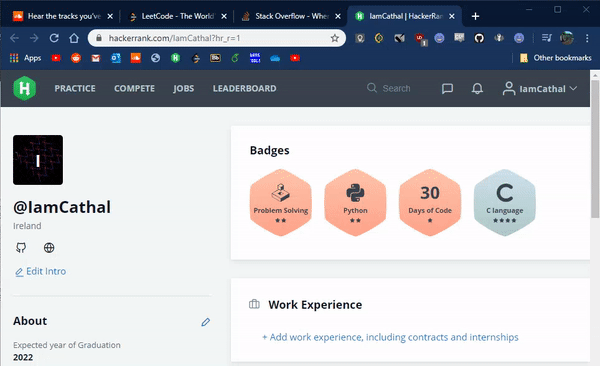

# ZipTab

A chrome/firefox extension made to manage online browsing workspaces. Create snapshots of all active tabs to save for later viewing.

### How to install

* #### Chrome

Currently this extension is not on the Chrome web store. To install you can instead load it from it's unpacked version. Also note this extension uses synced storage instead of local. This means that this extension will sync it's saved snapshots across all chrome browsers where you are logged in.

1. Clone or download this repo.
2. Navigate to `chrome://extensions/` and enable developer mode in the top right
3. Click load unpacked and select the folder `ZipTab/Chrome`
4. Enjoy

* ### FireFox

###### FireFox version not currently working properly